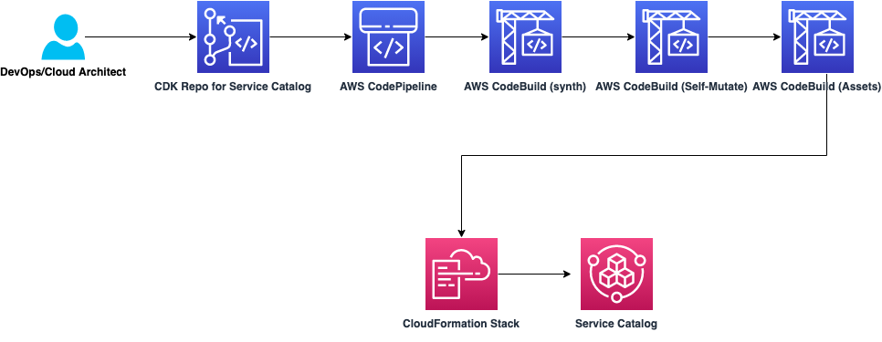
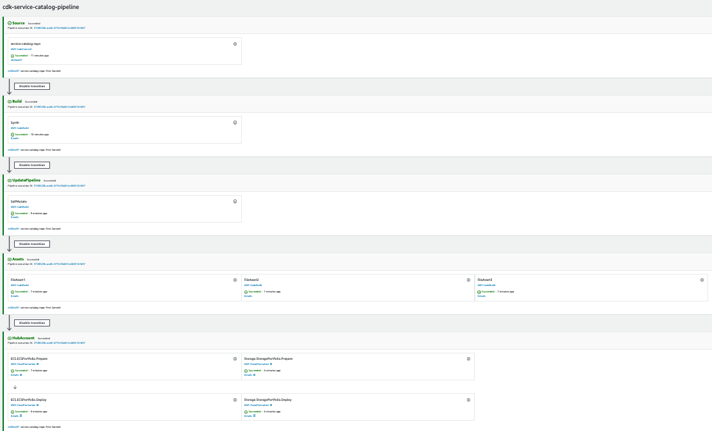

# CI/CD for Service Catalog products using AWS CodeCommit, AWS CodePipeline, AWS CodeBuild with CDK

The purpose of this repository is to demo how can we analyze and securize our Terraform code using a CI/CD Pipeline with a fully AWS services managed.

**Requirements**

- CDK installed: Getting started with the AWS CDK (Ensure a minimal version 1.103.0 to make it works)
- AWS Account
- IAM User or IAM role with permissions to create AWS Resources.
- Git installed: Git installation
- Clone this repo! : git clone https://github.com/aws-samples/aws-cdk-service-catalog-pipeline/
- Python CDK required libraries: (install with pip install -r requirements.txt)

**Pre-Requisites**
- Add the value of the hub account to the [cdk.json](cdk.json) hub_account

- Modify the [cdk.json](cdk.json) for the pipeline_account id and region to especify where in which environment you want to deploy this demo
- Modify other attributes in the [cdk.json](cdk.json) to share your portfolio to other accounts. Also shares with roles, groups or users who are going to operate and run the portfolio products:: 
   - "shared_accounts_ecs":["012345678901","012345678902"],
   - "shared_accounts_storage":["012345678901","012345678902"],
   - "roles":["arn:aws:iam::012345678901:role/awsomerole"],
   - "users":["arn:aws:iam::012345678901:user/awsomeuser"],
   - "groups":["arn:aws:iam::012345678901:group/awsomegroup],
   - "hub_account":"012345678901",
   - "pipeline_account":"012345678901",
   - "region":"eu-west-1"

## Architecture


## Provisioning the infrastructure

Clone the repo in your local machine. Then, bootstrap and deploy the CDK stack following the next steps

```
git clone https://github.com/aws-samples/cdk-service-catalog-pipeline
cd aws-cdk-service-catalog-pipeline
pip install -r requirements.txt
cdk bootstrap aws://account_id/eu-west-1
cdk deploy
```

The infrastructure creation takes around 3-5 minutes due the AWS CodePipelines and referenced repository creation. Once the CDK has deployed the infrastructure, clone the new AWS CodeCommit repos that have already been created and push this code into the repo. You can get the repository URL to push the code from the outputs of the stack that we just created. Connect(https://docs.aws.amazon com/codecommit/latest/userguide/how-to-connect.html), commit, and push code to this repository as described here:

```
cd ..
git clone https://git-codecommit.eu-west-1.amazonaws.com/v1/repos/service-catalog-repo
cd service-catalog-repo
git checkout -b main
cp -aR ../cdk-service-catalog-pipeline/* .
git add .
git commit -am "First commit"
git push --set-upstream origin main
```




## Adding a new Portfolio to the Pipeline

To add a new Portfolio to the Pipeline, we recommend creating a new class under [cdk_service_catalog](cdk_service_catalog) similar to [cdk_service_catalog_ecs_stack.py](cdk_service_catalog/cdk_service_catalog_ecs_stack.py). Once the new class is created with the products that we want to associate, we instantiate the new class inside [cdk_pipelines.py](cdk_pipelines/cdk_pipelines.py) and add it inside the wave in the stage. 
There are two ways to create portfolio products. One, like the [ECS example](cdk_service_catalog/cdk_service_catalog_ecs_stack.py) creating a Cloudformation template and the second one, the [Storage example](cdk_service_catalog/cdk_service_catalog_storage_stack.py) creating its own CDK stack that will be transformed into a template for the portfolio product.

## Clean up

After completing your demo, delete your stack using the CDK cli:
```
cdk destroy --all
```

## Conclusion

This code demonstrated how can we accelerate our Service Catalog deployments by building a CI/CD pipeline using self-managed services on AWS and CDK Pipelines

## Warning

Running this demo may result in charges to your AWS account.
Provisioning the supplied Products through ServiceCatalog will create AWS Services which will be billed to your account.

## Security

See [CONTRIBUTING](CONTRIBUTING.md#security-issue-notifications) for more information.

## License

This library is licensed under the MIT-0 License. See the LICENSE file.


